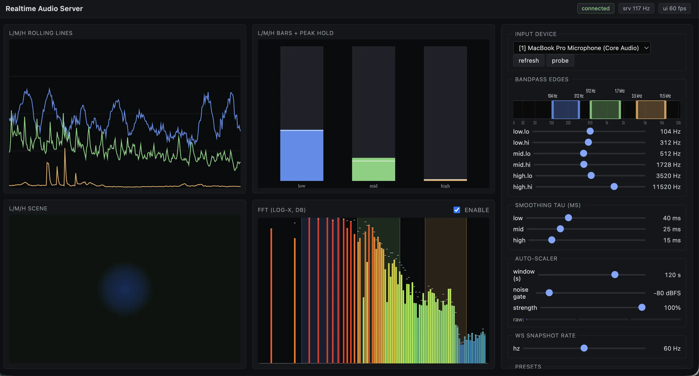
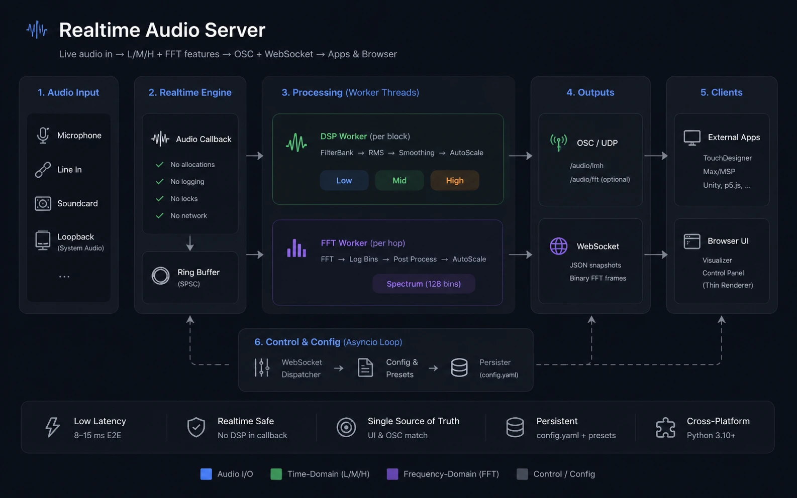

<p align="center">
  
</p>

# Realtime Audio Feature Server

A highly optimized, minimal latency, localhost Python server that captures live audio (mic, line-in, soundcard, loopback device, ...), computes perceptually-tuned **low / mid / high** band energies and an optional **128-bin log-spaced FFT spectrum**, and publishes them to:

- **External apps over OSC/UDP** (TouchDesigner, Max/MSP, Unity, custom scripts) — every audio block (~187 Hz at 48 kHz / 256 samples).
- **A browser visualizer over WebSocket** — coalesced to ~60 Hz, plus a binary FFT frame.

**The browser is a thin renderer.** All signal post-processing (smoothing, peak normalization, gating, tanh compression, strength blending, spatial peak smearing) runs server-side, in the same code path that feeds OSC. So **what you see in the FFT graph is byte-identical to the `/audio/fft` OSC payload** — you can tune every knob from the UI and trust the picture matches what downstream apps receive.

The browser UI also sends control messages back (toggle FFT, change band crossovers, switch input device, change smoothing, save/load presets). All settings persist to `config.yaml`, so the server boots back into the last-used state.

End-to-end input-to-OSC latency target: **8–15 ms**. The audio callback is allocation-free and runs no DSP — all filtering and FFT runs in worker threads. See `realtime_audio_server_plan.md` for the full design.

<p align="center">
  
</p>

## Setup

Requires Python 3.10+ and PortAudio.

```bash
# macOS
brew install portaudio

# Ubuntu/Debian
sudo apt install libportaudio2 portaudio19-dev
```

Then, from the repo root:

```bash
pip install -e ".[dev]"
```

## Run
python -m server.main --open

```bash
audio-server                  # reads ./config.yaml, opens WS on 8765, UI on 8766
audio-server --open           # also opens the UI in your default browser
audio-server --no-ws          # headless OSC-only mode
audio-server --device 2       # override input device by index
audio-server --config /path/to/cfg.yaml --log-level DEBUG
```

Equivalent to: `python -m server.main`.

The browser UI is at **http://127.0.0.1:8766** once the server is running. (Don't open `ui/index.html` directly with `file://` — ES modules won't load.)

---

## Integration guide (for external apps / coding agents)

This server is designed to be a feature provider for other projects. There are two ways to integrate, and they can be used together:

1. **OSC/UDP** — the "subscribe-only" path for realtime audio features (TouchDesigner, Max/MSP, Unity, p5.js, custom Python/JS apps). Lowest latency, every audio block.
2. **WebSocket** — full-duplex JSON + binary protocol used by the browser UI. Use this if you want to **change settings at runtime** (toggle FFT, switch input device, retune bands, save/load presets) or if you want **a richer feature payload** than OSC carries.

The server can run with both enabled (default), or in OSC-only headless mode (`--no-ws`).

### 1. Listening for audio features over OSC

OSC is sent to every destination listed under `osc.destinations` in `config.yaml`. Default is `127.0.0.1:9000`. Add more (or change the port) by editing the YAML and restarting:

```yaml
osc:
  destinations:
    - { host: 127.0.0.1, port: 9000 }
    - { host: 192.168.1.42, port: 7000 }
  send_fft: false              # set true to also stream /audio/fft
```

**Messages emitted:**

| Address      | Args                                                                                                       | Rate                                  | Notes                                                                                                       |
|--------------|------------------------------------------------------------------------------------------------------------|---------------------------------------|-------------------------------------------------------------------------------------------------------------|
| `/audio/meta`| `sr:i  blocksize:i  n_fft_bins:i  low_lo:f low_hi:f  mid_lo:f mid_hi:f  high_lo:f high_hi:f`               | Once at startup, again on device/FFT/cutoff change | Three independent bandpass edges (Hz). Use this to size your spectrum buffer and learn the actual sample rate the device opened at. |
| `/audio/lmh` | `low:f  mid:f  high:f`                                                                                     | Every audio block (~187 Hz @ 48k/256) | **Auto-scaled to ~[0, 1]** (peak follower + soft noise gate + tanh). These are the values VJ tools want.    |
| `/audio/fft` | `bin_0:f  bin_1:f  …  bin_{N-1}:f`                                                                         | Every FFT hop (~94 Hz @ hop=512/48k)  | Only sent when **both** `fft.enabled: true` **and** `osc.send_fft: true`. **Default: post-processed `[0, 1]`** (per-bin port of the L/M/H pipeline — same VJ-friendly semantics). Set `fft.send_raw_db: true` to ship raw dB instead. |

All floats are 32-bit. OSC addresses are flat (no nesting).

**Minimal Python receiver:**

```python
from pythonosc import dispatcher, osc_server

def lmh(_, low, mid, high):
    print(f"L={low:.2f} M={mid:.2f} H={high:.2f}")

def meta(_, sr, blocksize, n_fft_bins, low_lo, low_hi, mid_lo, mid_hi, high_lo, high_hi):
    print(f"sr={sr} bs={blocksize} fft_bins={n_fft_bins} "
          f"bands=[{low_lo}-{low_hi}] [{mid_lo}-{mid_hi}] [{high_lo}-{high_hi}]")

d = dispatcher.Dispatcher()
d.map("/audio/lmh", lmh)
d.map("/audio/meta", meta)
d.map("/audio/fft", lambda _addr, *bins: None)   # n_fft_bins floats

osc_server.BlockingOSCUDPServer(("127.0.0.1", 9000), d).serve_forever()
```

**TouchDesigner / Max:** point an OSC In CHOP / `udpreceive` at port 9000. Each `/audio/lmh` message arrives as three channels.

**Notes:**
- L/M/H over OSC is the **post-autoscale** value in `~[0, 1]`. Pre-autoscale (raw smoothed RMS) is only available over WebSocket (`low_raw/mid_raw/high_raw` in the snapshot message). A `/audio/lmh_raw` channel is on the v1.1 list.
- FFT bins over OSC default to **post-processed `[0, 1]` floats** — same per-bin auto-scaler pipeline used for L/M/H, just per FFT bin instead of per band. So the FFT and L/M/H feeds share the same scale and gate semantics out of the box. To get the raw dB log spectrum instead (e.g. for a meter or analyzer), flip `fft.send_raw_db: true` in `config.yaml` (or send `set_fft_send_raw_db` over WS, or toggle the "raw dB" checkbox in the UI). The same flag controls the WS binary frame's contents, so the UI viz always matches what's on the OSC wire.
- The FFT stream is gated by **two** flags: `fft.enabled` (turns the worker on) and `osc.send_fft` (decides whether to ship FFT bins to OSC consumers in addition to the WS client). You can have FFT enabled for the browser but skipped on OSC if you don't need it there.

### 2. Controlling the server over WebSocket

Connect to `ws://127.0.0.1:8765`. The server speaks JSON in both directions, plus binary frames for FFT data. **One** WebSocket carries control messages and data; multiple clients can connect simultaneously.

#### Outbound (server → client)

Text frames, JSON-encoded. `type` discriminates the message:

| `type`          | Payload (key fields)                                                                                                        | When                                          |
|-----------------|------------------------------------------------------------------------------------------------------------------------------|-----------------------------------------------|
| `meta`          | `sr, blocksize, n_fft_bins, bands{low,mid,high → {lo_hz, hi_hz}}, fft_enabled, fft_db_floor, fft_db_ceiling, fft_f_min, fft_send_raw_db, fft_peak_smear_oct, tau{low,mid,high}, autoscale{tau_attack_s, tau_release_s, noise_floor, strength}, ws_snapshot_hz, device{index, name}` | On connect; re-broadcast after any successful state mutation. Treat this as the source of truth for current settings — the UI reflects every checkbox/slider from the next `meta` instead of trusting local state. |
| `snapshot`      | `seq, low, mid, high, low_raw, mid_raw, high_raw, t`                                                                         | At `ws_snapshot_hz` (default 60 Hz). `low/mid/high` are auto-scaled `~[0, 1]`; `*_raw` are pre-autoscale smoothed RMS. |
| *(binary)*      | `[type=1:u8][reserved:u8][n_bins:u16 LE][float32 × n_bins LE]`                                                                | At FFT hop rate (~94 Hz) when FFT enabled. **Binary frame**, not JSON. Float interpretation depends on `meta.fft_send_raw_db`: `false` (default) → post-processed `[0, 1]`; `true` → raw wire dB with `-1000` sentinels for empty log bins. The same bytes are what `/audio/fft` sends on OSC. |
| `devices`       | `items: [{index, name, hostapi, default_samplerate, max_input_channels, probed_signal?, probed_at?}]`                        | On connect, and in reply to `list_devices`.   |
| `presets`       | `items: [{name, saved_at}]`                                                                                                  | On connect, after `save_preset`, in reply to `list_presets`. |
| `server_status` | `cb_overruns, dsp_drops, fft_drops, perf{cb, dsp, fft, ws → {avg_ms, p95_ms, load_pct}, block_period_ms, hop_period_ms, ws_period_ms}` | At 2 Hz. Diagnostics — you usually don't need it. |
| `error`         | `reason: string`                                                                                                             | In reply to a malformed/invalid inbound message. The server state is unchanged. |

#### Inbound (client → server)

Text frames, JSON. Validation runs before any mutation; on failure you get an `error` reply and **state is unchanged**.

| `type`                | Required fields                                                                                  | Notes                                                                                                                            |
|-----------------------|--------------------------------------------------------------------------------------------------|----------------------------------------------------------------------------------------------------------------------------------|
| `set_fft`             | `enabled: bool`                                                                                  | Turn the FFT worker on/off. Persisted immediately.                                                                               |
| `set_band`            | `band: "low" \| "mid" \| "high", lo_hz: number, hi_hz: number, commit?: bool`                    | Updates one of the three bandpasses. Range per band: `lo_hz ≥ 20`, `hi_hz > lo_hz + 50`, `hi_hz ≤ 0.45·sr`. Bands may overlap. Server-side debounce 50 ms. |
| `set_smoothing`       | `tau: {low?: number, mid?: number, high?: number}, commit?: bool`                                | Each τ in `[0.005, 2.0]` seconds. Only present bands are mutated. Drives BOTH the L/M/H smoother AND the per-bin FFT smoother (taus interpolated piecewise-linearly in log-frequency from the L/M/H band geometric centers). |
| `set_autoscale`       | `tau_attack_s?: number, tau_release_s?: number, noise_floor?: number, strength?: number, commit?: bool` | `tau_attack_s ∈ [0.001, 1]` s (peak follower attack, default 0.05). `tau_release_s ∈ [5, 300]` s (release / "rolling window"). `noise_floor ∈ [0, 0.1]` linear RMS. `strength ∈ [0, 1]` (1 = fully auto-scaled, 0 = raw). Any subset; missing fields stay unchanged. Drives BOTH the L/M/H `AutoScaler` and the FFT per-bin `FFTPostProcessor`. |
| `set_fft_send_raw_db` | `send_raw_db: bool`                                                                              | Selects the FFT stream sent to OSC AND WS. `false` (default): post-processed `[0, 1]`. `true`: raw wire dB. The UI reflects this from the next `meta` and the FFT viz switches its y-axis (dB ↔ scaled) accordingly. |
| `set_fft_peak_smear`  | `peak_smear_oct: number, commit?: bool`                                                           | `peak_smear_oct ∈ [0, 3]` octaves. Gaussian smear of the per-bin peak follower across the spectrum. `0` = each bin self-normalizes (single-frequency tones over-attenuate); higher = peaks are shared across log-frequency neighborhood so a tone still reads taller than its spectral context. Reflect-padded edges. FFT-only — L/M/H has no spectral neighborhood. |
| `list_devices`        | `probe?: bool`                                                                                   | Returns a `devices` message. With `probe: true` the server briefly opens each device and reports which produced signal.          |
| `set_device`          | `index: int`                                                                                     | Hot-switches the input device. Stream is torn down + rebuilt; sample rate may change; filters/FFT/autoscaler re-init.            |
| `set_n_fft_bins`      | `n: int`                                                                                         | Range `[8, 1024]`. Rebuilds the log-bin map atomically.                                                                          |
| `set_ws_snapshot_hz`  | `hz: number, commit?: bool`                                                                      | Range `[15, 240]`. Affects WS L/M/H rate only — OSC stays at full block rate, FFT WS frames stay on the FFT worker's clock.       |
| `list_presets`        | —                                                                                                | Returns a `presets` message.                                                                                                     |
| `save_preset`         | `name: string`                                                                                   | Name `1–64` chars, `[A-Za-z0-9_\- ]` only. Snapshots DSP / autoscale / FFT view into `<config_dir>/preset-<name>.yaml`.           |
| `load_preset`         | `name: string`                                                                                   | Validates each field, applies via the same handlers a slider would, then persists the resulting state to `config.yaml`.          |

**Drag-aware persistence.** Sliders should send `commit: false` while dragging and `commit: true` on release. The audio mutation is applied immediately either way; only the YAML write is debounced (1 s during drag, 50 ms on commit, capped at 250 ms wall-clock from the first dirty change).

#### Minimal JS client

```js
const ws = new WebSocket("ws://127.0.0.1:8765");
ws.binaryType = "arraybuffer";

ws.addEventListener("message", (ev) => {
  if (typeof ev.data === "string") {
    const msg = JSON.parse(ev.data);
    if (msg.type === "snapshot") {
      // msg.low / msg.mid / msg.high in ~[0, 1]
    } else if (msg.type === "meta") {
      // current server settings
    }
  } else {
    // binary FFT frame
    const view = new DataView(ev.data);
    const nBins = view.getUint16(2, /*LE*/ true);
    // Values are post-processed [0, 1] by default, or raw wire dB if
    // meta.fft_send_raw_db is true. Check the most recent meta to decide.
    const bins = new Float32Array(ev.data, 4, nBins);
  }
});

ws.addEventListener("open", () => {
  ws.send(JSON.stringify({ type: "set_fft", enabled: true }));
  ws.send(JSON.stringify({ type: "set_band", band: "mid", lo_hz: 200, hi_hz: 4000, commit: true }));
});
```

#### Minimal Python client

```python
import asyncio, json, struct
import websockets

async def main():
    async with websockets.connect("ws://127.0.0.1:8765") as ws:
        await ws.send(json.dumps({"type": "set_fft", "enabled": True}))
        async for frame in ws:
            if isinstance(frame, str):
                msg = json.loads(frame)
                if msg["type"] == "snapshot":
                    print(msg["low"], msg["mid"], msg["high"])
            else:
                _t, _r, n = struct.unpack_from("<BBH", frame, 0)
                # bins = struct.unpack_from(f"<{n}f", frame, 4)

asyncio.run(main())
```

### 3. Tuning L/M/H by watching the FFT

The L/M/H pipeline (per-band IIR bandpass → RMS → smoother → auto-scaler) and the FFT post-processor share the same control knobs:

- **`set_smoothing`** drives both the L/M/H exponential smoother AND the FFT per-bin smoother. The FFT bin τ is piecewise-linearly interpolated in log-frequency from the L/M/H band geometric-mean centers (so dragging the "low" τ lazes out the bass FFT bins, the "mid" τ the midrange bins, etc.).
- **`set_autoscale`** drives both the L/M/H `AutoScaler` and the FFT per-bin peak follower (same attack/release/floor/strength).
- **`set_band`** moves the IIR bandpass edges AND re-anchors the FFT smoothing-τ interpolation onto the new band centers.

So the FFT visualizer is more than a spectrum — it's a continuous, high-resolution preview of what every L/M/H knob is doing. Tune until the FFT viz looks the way you want, and the L/M/H output going to OSC will follow the same response shape.

The two FFT-specific knobs that don't have an L/M/H equivalent:

- **`fft.send_raw_db`** — selects the wire format. `false` (default): post-processed `[0, 1]`. `true`: raw dB log spectrum. Toggling switches both the OSC payload and the UI viz simultaneously.
- **`fft.peak_smear_oct`** — Gaussian smear (in octaves) of the per-bin peak follower. Without it, a sustained single-frequency tone drives ITS bin's peak high enough to fully self-normalize, so the tone bin reads *smaller* than its quiet neighbors. Smearing the peak across log-frequency neighbors keeps the local frequency contour intact while still flattening the long-term spectral envelope. Has no L/M/H equivalent because L/M/H has no spectral neighborhood.

### 4. Toggling FFT from outside the UI

Three equivalent ways, depending on what you have:

- **WebSocket:** send `{"type": "set_fft", "enabled": true}`.
- **Edit `config.yaml`:** set `fft.enabled: true` and restart the server. (Live edits to `config.yaml` are not picked up — the server *writes* the file but does not watch it.)
- **For OSC consumers:** also set `osc.send_fft: true` in `config.yaml`, otherwise FFT bins won't be sent over OSC even when the worker is on.

### 5. Picking the input device

Either set it in `config.yaml`:

```yaml
audio:
  device: { name: "BlackHole 2ch", index: 3 }   # name preferred, index advisory
```

…or pass `--device <index>` on startup, or send `{"type": "set_device", "index": N}` over WS at runtime. To enumerate, send `{"type": "list_devices", "probe": true}` and read the `devices` reply.

For multichannel pro interfaces / aggregate devices where channel 0/1 isn't the stereo pair you want, use `sounddevice`'s device mapping rather than relying on the auto stereo mono-mix.

### 6. Headless / OSC-only deployments

If you don't need the browser UI or runtime control:

```bash
audio-server --no-ws
```

The WS server, broadcaster, and dispatcher are not started; only OSC + the audio pipeline + persistence run. Change settings by editing `config.yaml` and restarting (or temporarily run with WS enabled to tune via the UI, then drop back to `--no-ws`).

### 7. Defaults summary

| Knob                      | Default        | Where to change                                  |
|---------------------------|----------------|--------------------------------------------------|
| WS server port            | `8765`         | `config.yaml: ws.port`                           |
| UI HTTP port              | `8766`         | `config.yaml: ws.http_port`                      |
| OSC destination           | `127.0.0.1:9000` | `config.yaml: osc.destinations[]`              |
| OSC sends FFT             | `false`        | `config.yaml: osc.send_fft`                      |
| FFT enabled               | `false`        | WS `set_fft` or `config.yaml: fft.enabled`       |
| FFT bins                  | `128`          | WS `set_n_fft_bins` or `config.yaml: fft.n_bins` |
| FFT stream over OSC/WS    | post-processed `[0, 1]` | WS `set_fft_send_raw_db` (or "raw dB" UI checkbox) or `config.yaml: fft.send_raw_db` |
| FFT peak smear            | `0.3` oct      | WS `set_fft_peak_smear` or `config.yaml: fft.peak_smear_oct` |
| Bandpass edges            | low `30–250`, mid `250–4000`, high `4000–16000` Hz | WS `set_band` or `config.yaml: dsp.{low,mid,high}` |
| Smoothing τ (low/mid/high)| `0.15 / 0.06 / 0.02` s — drives both L/M/H and (interpolated) FFT smoother | WS `set_smoothing` or `config.yaml: dsp.tau` |
| Peak-follower attack τ    | `0.05` s       | WS `set_autoscale.tau_attack_s` or `config.yaml: autoscale.tau_attack_s` |
| Peak-follower release τ   | `60` s         | WS `set_autoscale.tau_release_s` or `config.yaml: autoscale.tau_release_s` |
| Noise floor               | `0.001` linear RMS (~−60 dBFS) — applied to L/M/H AND FFT (calibrated)  | WS `set_autoscale.noise_floor` |
| Autoscale strength        | `1.0`          | WS `set_autoscale.strength` (0 = pass-through raw, 1 = fully scaled) |
| WS snapshot rate          | `60` Hz        | WS `set_ws_snapshot_hz` or `config.yaml: ws.snapshot_hz` |

---

## Notes

- `config.yaml` is **rewritten automatically** every time the UI changes a setting (atomic, debounced). Make sure its parent directory is writable. Saved presets live alongside as `preset-<name>.yaml`.
- For non-default stereo channel pairs (aggregate devices, multichannel pro interfaces), pick the input channel via `sounddevice`'s device mapping rather than relying on the auto stereo mono-mix.
- Tests live under `tests/` but the suite is empty for now.
